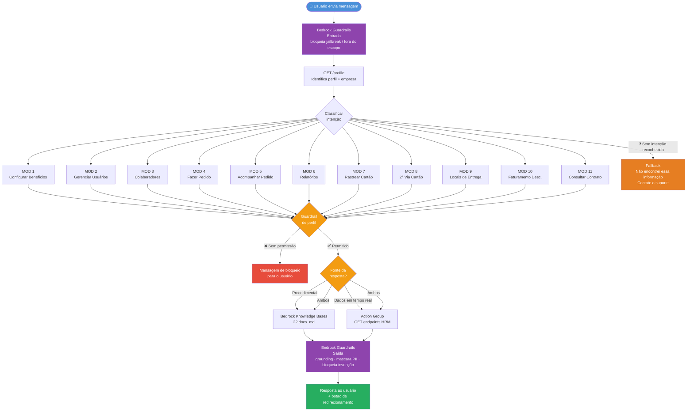

# Workflow do Bot — Caminhos de Decisão

Mapeamento dos fluxos que o bot precisa navegar com base nos 22 documentos da pasta `docs`. Cada módulo representa um caminho distinto que o agente deve ser capaz de percorrer.

---

## Diagrama Geral



---

## Fluxo Principal — Roteamento de Intenção

```
Usuário envia mensagem
        ↓
[GET /profile] → Identifica perfil + empresa
        ↓
Classificar intenção
        ↓
┌─────────────────────────────────────────────────────────┐
│                                                         │
│  Configurar benefícios?  → MOD 1                        │
│  Gerenciar usuários?     → MOD 2                        │
│  Colaboradores?          → MOD 3                        │
│  Fazer pedido?           → MOD 4                        │
│  Acompanhar pedido?      → MOD 5                        │
│  Relatórios?             → MOD 6                        │
│  Rastrear cartão?        → MOD 7                        │
│  2ª via de cartão?       → MOD 8                        │
│  Locais de entrega?      → MOD 9                        │
│  Faturamento desc.?      → MOD 10                       │
│  Consultar contrato?     → MOD 11                       │
│                                                         │
└─────────────────────────────────────────────────────────┘
        ↓
Verificar guardrail de perfil
        ↓
Responder com RAG + API conforme o módulo
```

---

## MOD 1 — Configuração de Benefícios

**Fonte:** RAG (`1CONFIG_BENE_1.md`, `1CONFIG_BENE_REDES.md`)
**API:** nenhuma — apenas orientação procedimental

```
Pergunta sobre configuração de benefícios
        ↓
[GUARDRAIL] Perfil = Decisão ou Gerenciamento?
        ├── NÃO → "Seu perfil não permite configurar benefícios."
        └── SIM ↓
Perguntar qual a dúvida específica
        ├── Como habilitar? → RAG: passo a passo de toggle por modalidade
        ├── Quais redes aceitam cada benefício? → RAG: tabela de redes por tipo
        └── O que acontece se não configurar? → RAG: sem benefício habilitado, pedidos bloqueados
        ↓
[BOTÃO] "Ir para Configuração de Benefícios"
```

---

## MOD 2 — Gerenciar Interlocutores (Usuários)

**Fonte:** RAG (`2CADASTRO_INTERLO_PERFIS.md`, `2CADASTRO_INTERLO_EDITAR.md`)
**API:** nenhuma — orientação procedimental

```
Pergunta sobre usuários/interlocutores
        ↓
[GUARDRAIL] Perfil = Decisão?
        ├── NÃO → "Apenas o perfil Decisão pode gerenciar usuários."
        └── SIM ↓
Identificar dúvida
        ├── Quais perfis existem e o que cada um pode fazer?
        │       → RAG: tabela de permissões por perfil
        ├── Como adicionar um usuário?
        │       → RAG: fluxo de 2 etapas (dados pessoais → dados profissionais)
        ├── Como bloquear/excluir?
        │       → RAG: ações por linha na listagem
        └── Como mudar para perfil Decisão?
                → RAG: "Não é possível pelo sistema — definido em contrato com a Alelo."
        ↓
[BOTÃO] "Ir para Usuários do Sistema"
```

---

## MOD 3 — Cadastro de Colaboradores

**Fonte:** RAG (`3CADASTRO_COLAB_TELA.md`, `3CADASTRO_COLAB_PLANILHA.md`, `3CADASTRO_COLAB_TAGS.md`)
**API:** `GET /beneficiaries` (listar colaboradores existentes), `GET /places` (listar filiais)

```
Pergunta sobre colaboradores
        ↓
[GUARDRAIL] Perfil = Decisão, Gerenciamento ou Operação?
        ├── NÃO (Financeiro) → "Seu perfil não tem acesso ao cadastro de colaboradores."
        └── SIM ↓
Identificar dúvida
        ├── "Quais colaboradores tenho?"
        │       → [API] GET /beneficiaries → exibe lista
        │
        ├── "Como cadastrar um colaborador?" → RAG: fluxo de 2 etapas
        │       ↓ Tipo de entrega?
        │       ├── Filial → RAG: selecionar CNPJ da filial cadastrada
        │       └── Residência → RAG: preencher endereço completo
        │
        ├── "Como importar vários colaboradores de uma vez?"
        │       → RAG: planilha .xls/.xlsx + campos obrigatórios + comportamento de reimportação
        │
        ├── "Por que o colaborador não tem tag de produto ainda?"
        │       → RAG: tags atribuídas apenas ao vincular ao pedido, não no cadastro
        │
        └── "Posso alterar o CPF de um colaborador?"
                → RAG: "Não — CPF não pode ser alterado após o cadastro."
        ↓
[BOTÃO] "Ir para Cadastro de Colaboradores"
```

---

## MOD 4 — Realizar Pedido de Crédito

**Fonte:** RAG (`4PEDIDO_TELA.md`, `4PEDIDO_PLANILHA.md`, `5PAG_DISPO.md`, `5PAG_DISPO_BOLETO.md`, `5PAG_DISPO_MODELO_COBRANCA.md`)
**API:** `GET /benefits`, `GET /products`, `GET /beneficiaries`, `GET /places`, `GET /availability-dates-for-credit`

```
Pergunta sobre fazer um pedido
        ↓
[GUARDRAIL] Perfil = Decisão, Gerenciamento ou Operação?
        ├── NÃO → "Seu perfil não permite realizar pedidos."
        └── SIM ↓
Identificar dúvida
        │
        ├── "Como faço um pedido?" → RAG: visão geral das 5 etapas
        │       ↓ Qual método?
        │       ├── Pela tela → RAG: fluxo manual passo a passo
        │       └── Por planilha → RAG: modelo de importação + campos obrigatórios
        │
        ├── "Quando os créditos ficam disponíveis?"
        │       ↓ Tipo de disponibilização?
        │       ├── Automática → RAG: até 2 dias úteis após compensação do boleto
        │       └── Agendada → RAG: data escolhida; boleto deve ser pago antes        │    
        │
        ├── "Como funciona a cobrança/taxas?"
        │       → RAG: modelo de taxas diferidas (1º pedido vs. pedidos seguintes)
        │
        ├── "Quais formas de pagamento existem?"
        │       → RAG: apenas boleto bancário
        │
        └── "Posso adicionar um colaborador novo direto no pedido?"
                → RAG: sim, mas CPF novo exige validação na Receita Federal (pode causar atraso)
        ↓
Resposta
```

---

## MOD 5 — Acompanhar Pedidos

**Fonte:** RAG (`6ACOMPA_PEDIDO_STATUS.md`, `6ACOMPA_PEDIDO_BOLETO_NF.md`, `6ACOMPA_PEDIDO_ALTERAR_DATA_CREDITOS.md`)
**API:** `GET /orders`, `GET /orders/{n}`, `GET /orders/{n}/beneficiaries`, `GET /orders/{n}/bank-ticket`, `GET /orders/{n}/invoice`

```
Pergunta sobre acompanhamento de pedido
        ↓
Identificar dúvida
        │
        ├── "Quais são meus pedidos?" / "Status dos pedidos?"
        │       → [API] GET /orders → exibe lista com status atual dos últimos 3 pedidos
        │
        ├── "O que significa o status X?"
        │       → RAG: tabela de status e significados
        │       (Aguardando pagamento → Pagamento confirmado → NF Emitida
        │        → Aguardando Disponibilização → Creditado | Cancelado)
        │
        ├── "Onde está meu boleto?"
        │       → [API] GET /orders/{n}/bank-ticket → verificar se há url do boleto
        │       → RAG: boleto disponível imediatamente após confirmação do pedido
        │
        ├── "Onde está minha nota fiscal do pedido específico?"
        │       → [API] GET /orders/{n}/invoice → retorna link da NF
        │       → RAG: NF só disponível após crédito nos cartões
        │       ↓ Se NF ainda não disponível
        │       → "A nota fiscal é emitida após os créditos serem carregados nos cartões."
        │
        ├── "Quem está neste pedido?"
        │       → [API] GET /orders/{n}/beneficiaries → lista colaboradores do pedido
        │
        ├── "Como altero a data de disponibilização do crédito?"
        │       → RAG: fluxo de 4 passos (somente para pedidos já pagos, sem tarifa adicional)
        │       ↓ Pedido está pago?
        │       ├── NÃO → "Só é possível alterar após a confirmação do pagamento."
        │       └── SIM → [BOTÃO] "Ver detalhe do pedido para alterar data"
        │
        └── "Por que meu pedido foi cancelado?"
                → RAG: cancelamento automático após 30 dias sem pagamento do boleto
        ↓
[BOTÃO] "Ir para Acompanhamento de Pedidos"
```

---

## MOD 6 — Relatórios

**Fonte:** RAG (`7RELATORIOS.md`)
**API:** sem endpoint GET de relatórios confirmado — orientação procedimental

```
Pergunta sobre relatórios
        ↓
Identificar dúvida
        ├── "Quais relatórios estão disponíveis?"
        │       → RAG: 4 tipos (Sintético de Cobrança PDF, Analítico PDF, Disponibilização PDF, Espelho EXCEL)
        │
        ├── "Como solicitar um relatório?"
        │       → RAG: passo a passo de solicitação no menu Relatórios
        │
        ├── "Meu relatório está demorando / com erro"
        │       → RAG: status possíveis (Aguardando processamento / Disponibilizado / Erro)
        │       ↓ Se erro → "Tente solicitar novamente. Se persistir, contate o suporte."
        │
        └── "Diferença entre Sintético e Analítico?"
                → RAG: Sintético = visão geral; Analítico = detalhe de taxas de um pedido específico
        ↓
[BOTÃO] "Ir para Relatórios"
```

---

## MOD 7 — Rastreio de Cartões

**Fonte:** RAG (`8RASTREIO_CARTOES.md`)
**API:** `GET /tracking`, `GET /orders/{n}/tracking`, `GET /orders/{n}/tracking/{ar}/detail`

```
Pergunta sobre rastreio de cartão
        ↓
Identificar dúvida
        │
        ├── "Como está o rastreio dos meus cartões?"
        │       → [API] GET /tracking → exibe lista de pedidos em rastreio (listar os últimos 3)
        │
        ├── "Qual o status do cartão do pedido X?"
        │       → [API] GET /orders/{n}/tracking → exibe ARs e status
        │
        ├── "Detalhe do envio / onde está o cartão?"
        │       → [API] GET /orders/{n}/tracking/{ar}/detail → exibe timeline, endereço, responsável
        │
        ├── "Por que não consigo ver o rastreio?"
        │       → RAG: rastreio disponível somente após entrega à transportadora
        │
        └── "O rastreio está com erro"
                → RAG: orientar contato com central de atendimento
        ↓
[BOTÃO] "Ir para Rastreio de Cartões"
```

---

## MOD 8 — 2ª Via de Cartão

**Fonte:** RAG (`manual-emissao-2via.md`)
**API:** `GET /products`, `GET /beneficiaries` (para exibir elegíveis)

```
Pergunta sobre 2ª via de cartão
        ↓
[GUARDRAIL] Perfil com acesso a pedidos?
        ├── Financeiro → "Seu perfil não permite solicitar 2ª via."
        └── SIM ↓
Identificar dúvida
        │
        ├── "Como solicitar 2ª via?"
        │       → RAG: fluxo de 4 passos  + link      │ 
        │
        ├── "Motivos aceitos para 2ª via?"
        │       → RAG: apenas Perda ou Roubo
        │       → Outros motivos → "Contate a central de atendimento."
        │
        ├── "O que acontece com o cartão atual?"
        │       ↓ Tipo do cartão?
        │       ├── Físico → RAG: cancelado automaticamente ao confirmar
        │       └── Virtual → RAG: permanece ativo até ativação do novo cartão físico
        │
        ├── "Quanto custa?"
        │       → RAG: taxa de reemissão aparece no próximo pedido (não cobrada imediatamente)
        │
        ├── "Posso cancelar a solicitação?"
        │       → RAG: "Não — o processo é irreversível após a confirmação."
        │
        └── "Quando o cartão chega?"
                → RAG: 7 a 10 dias úteis; rastreio disponível após despacho para transportadora
        ↓
[BOTÃO] "Ir para Emissão de 2ª Via"
```

---

## MOD 9 — Locais de Entrega (Filiais e Postos)

**Fonte:** RAG (`10CADASTRO_FILIAIS_TELA.md`, `10CADASTRO_POSTO_DE_TRABALHO_PLANILHA.md`)
**API:** `GET /places`

```
Pergunta sobre locais de entrega
        ↓
Identificar dúvida
        │
        ├── "Quais locais de entrega tenho cadastrados?"
        │       → [API] GET /places → exibe lista (filtro por BRANCH ou WORKPLACE)
        │
        ├── "Como cadastrar uma filial?"
        │       → RAG: modal de 3 etapas (dados cadastrais → responsáveis cartões → responsáveis NF)
        │
        ├── "Como cadastrar postos de trabalho em massa?"
        │       → RAG: planilha .xls/.xlsx com tipo PT + código + endereço (até 15MB)
        │
        ├── "Posso alterar o CNPJ de uma filial?"
        │       → RAG: "Não — raiz e final do CNPJ não podem ser editados após o cadastro."
        │
        └── "Como excluir um local?"
                → RAG: lixeira → confirmação → irreversível
                → RAG: CNPJ Contratante não pode ser excluído, apenas editado
        ↓
[BOTÃO] "Ir para Locais de Entrega"
```

---

## MOD 10 — Faturamento Descentralizado

**Fonte:** RAG (`faturamento-descentralizado.md`)
**API:** `GET /companies`, `GET /orders` (número de solicitação agrupa pedidos)

```
Pergunta sobre faturamento descentralizado
        ↓
Identificar dúvida
        │
        ├── "O que é faturamento descentralizado?"
        │       → RAG: conceito de boletos separados por CNPJ de faturamento por filial
        │
        ├── "Como configurar?"
        │       → RAG: campo "CNPJ para Faturamento" no cadastro do local de entrega
        │
        ├── "Por que recebi mais de um boleto para o mesmo pedido?"
        │       → RAG: cada filial com CNPJ de faturamento diferente gera boleto separado
        │       → [API] GET /orders → exibe número de solicitação agrupador
        │
        ├── "O que é o Número de Solicitação?"
        │       → RAG: agrupador único de todos os sub-pedidos gerados por um pedido com faturamento desc.
        │
        └── "Preciso pagar todos os boletos?"
                → RAG: sim — todos devem ser pagos para disponibilização integral dos créditos
        ↓
[BOTÃO] "Ir para Acompanhamento de Pedidos"
```

---

## MOD 11 — Consultar Contrato

**Fonte:** RAG (`9VISUALIZAR_CONTRATOS.md`)
**API:** `GET /companies` (dados da empresa), `GET /products` (produtos do contrato)

```
Pergunta sobre contrato
        ↓
Identificar dúvida
        │
        ├── "Como consulto meu contrato?"
        │       → RAG: Menu Administração > Contratos
        │       → [API] GET /companies → exibe empresas/contratos disponíveis
        │
        ├── "Quais são as taxas do meu contrato?"
        │       → RAG: tabela de tarifas (emissão R$10, reemissão R$15, entrega corp. R$5, res. R$2, crédito R$2)
        │
        ├── "Como altero o responsável / interlocutor Decisão?"
        │       → RAG: "Não é possível pelo sistema — contate a central de atendimento."
        │
        └── "O que significa cada campo do contrato?"
                → RAG: descrição dos campos (produto, status, vendedor, dados cadastrais, entrega)
        ↓
[BOTÃO] "Ir para Contratos"
```

---

## Guardrails por Perfil — Tabela de Acesso

| Módulo | Decisão | Gerenciamento | Operação | Financeiro |
|---|---|---|---|---|
| MOD 1 Configurar benefícios | ✅ | ✅ | ❌ | ❌ |
| MOD 2 Gerenciar usuários | ✅ | ❌ | ❌ | ❌ |
| MOD 3 Colaboradores | ✅ | ✅ | ✅ | ❌ |
| MOD 4 Fazer pedido | ✅ | ✅ | ✅ | ❌ |
| MOD 5 Acompanhar pedido | ✅ | ✅ | ✅ | ⚠️ só boleto/NF |
| MOD 6 Relatórios | ✅ | ✅ | ✅ | ✅ |
| MOD 7 Rastrear cartão | ✅ | ✅ | ✅ | ❌ |
| MOD 8 2ª via cartão | ✅ | ✅ | ✅ | ❌ |
| MOD 9 Locais de entrega | ✅ | ✅ | ✅ | ❌ |
| MOD 10 Faturamento desc. | ✅ | ✅ | ✅ | ⚠️ só leitura |
| MOD 11 Consultar contrato | ✅ | ✅ | ✅ | ✅ |

---

## Fallback Global

```
Bot não encontrou resposta no RAG nem na API
        ↓
"Não encontrei informações sobre isso na nossa base de conhecimento.
Para mais detalhes, entre em contato com o suporte Alelo."
        ↓
[BOTÃO] "Falar com o Suporte"
```

---

## Decisões de Design a Detalhar

| Ponto | Decisão pendente |
|---|---|
| Perfil Financeiro em MOD 5 | Confirmar quais sub-fluxos são permitidos (boleto e NF confirmados — demais?) |
| MOD 8 — escrita | A solicitação de 2ª via exige `POST` — fora do escopo do bot no MVP; apenas orientar e redirecionar |
| Contexto de empresa | Usuário com múltiplas empresas: bot deve confirmar qual empresa está operando antes de chamar APIs |
| Classificação de intenção | Definir se usamos prompt engineering puro no Bedrock Agents ou um nó de classificação dedicado |
