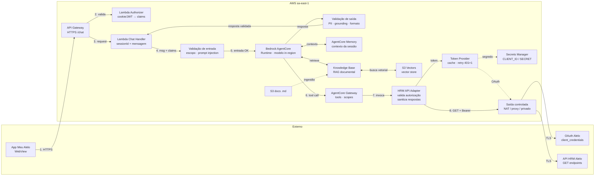
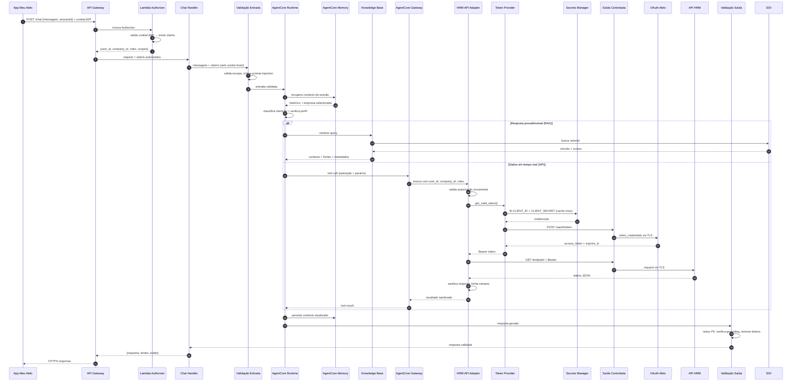

# Infraestrutura AWS — MVP Bot Alelo

**Região:** sa-east-1 (São Paulo)
**Restrição:** cross-region inference desativado · todos os componentes em sa-east-1
**Paradigma:** Serverless + Managed AI
**Diagrama de referência:** `docs/desenhos/arquitetura_bot_alelo_v2.drawio.xml`

---

## Disponibilidade Regional Confirmada (sa-east-1)

| Serviço | Disponível | Fonte de confirmação | Data |
|---|---|---|---|
| Amazon Bedrock AgentCore Runtime | ✅ | AWS Regions doc | Jul 2026 |
| Amazon Bedrock AgentCore Gateway | ✅ | AWS Regions doc | Jul 2026 |
| Amazon Bedrock AgentCore Memory | ✅ | Anúncio AWS (streaming LTM) | Mar 2026 |
| Amazon Bedrock AgentCore Observability | ✅ | AWS Regions doc | Jul 2026 |
| Amazon Bedrock Knowledge Bases | ✅ | AWS Regions doc | Jul 2026 |
| Amazon S3 Vectors | ✅ | Expansão 17 regiões | Mar 2026 |
| Amazon Bedrock Guardrails | ✅ | AWS Regions doc | Jul 2026 |
| Amazon Titan Embeddings V2 | ✅ | Bedrock models catalog | Jul 2026 |
| Amazon API Gateway | ✅ | Serviço global | — |
| AWS Lambda | ✅ | Serviço global | — |
| AWS Secrets Manager | ✅ | Serviço global | — |
| Amazon S3 | ✅ | Serviço global | — |
| Amazon CloudWatch | ✅ | Serviço global | — |
| AgentCore Harness | ❌ | Não listado em sa-east-1 | Jul 2026 |
| AgentCore Evaluations | ❌ | Não listado em sa-east-1 | Jul 2026 |

---

## Visão Geral da Arquitetura

> Diagrama completo nas 3 páginas do Draw.io. Abaixo, representação Mermaid simplificada.



---

## Fluxo de uma Requisição



---

## Componentes

### 1. App Meu Alelo (externo)

- WebView no app nativo (mobile e web)
- Cookie ou JWT da sessão do usuário autenticado
- Nenhuma credencial técnica da API no cliente
- Comunicação HTTPS com API Gateway

### 2. Edge e Autenticação

| Componente | Tecnologia | Responsabilidade |
|---|---|---|
| **API Gateway** | Amazon API Gateway (HTTP API) | Endpoint HTTPS `/chat`; CORS restritivo; rate limiting |
| **Lambda Authorizer** | AWS Lambda (Python) | Valida cookie/JWT; retorna claims mínimos: `user_id`, `company_id`, `roles`, `scopes` |
| **Lambda Chat Handler** | AWS Lambda (Python) | Recebe `sessionId` + mensagem + claims; orquestra chamada ao AgentCore; retorna resposta |

**Separação de responsabilidades:**
- Autenticação da pessoa usuária → Authorizer
- Autorização para acessar recursos → AgentCore + HRM API Adapter
- Autenticação técnica na API HRM → Token Provider (client_credentials)

**Regra crítica:** O cookie/JWT bruto nunca é enviado ao modelo. Apenas os claims mínimos entram no contexto do agente.

### 3. Validação de Entrada

Componente lógico (implementado no Chat Handler ou como middleware) responsável por:

- Validar que a mensagem está dentro do escopo do bot
- Aplicar regras da aplicação (tamanho máximo, formato)
- Mitigar prompt injection (detecção de padrões maliciosos)
- Rejeitar solicitações fora do escopo antes de enviar ao modelo
- Reduzir os dados enviados ao modelo (apenas o necessário)

> ⚠️ Esta camada **reduz o risco** de ataques mas não os elimina totalmente. É um controle de mitigação, não uma garantia absoluta.

### 4. IA e Orquestração

| Componente | Tecnologia | Responsabilidade |
|---|---|---|
| **AgentCore Runtime** | Amazon Bedrock AgentCore | Orquestração principal; decide RAG vs API vs híbrido; mantém fluxo conversacional |
| **Modelo LLM** | Modelo Bedrock in-region (a definir) | Geração de respostas; classificação de intenção |
| **AgentCore Memory** | Amazon Bedrock AgentCore Memory | Contexto da sessão: histórico, empresa selecionada, último recurso mencionado |
| **AgentCore Gateway** | Amazon Bedrock AgentCore Gateway | Catálogo de ferramentas; contratos; scopes; roteamento de tool calls |

**Modelo LLM:** A definir com base na disponibilidade in-region em sa-east-1. Candidatos: Claude (Haiku/Sonnet), Amazon Nova. Pendente de validação de quais versões específicas estão disponíveis.

### 5. RAG — Knowledge Base

#### Runtime (consulta)

```
AgentCore Runtime
    → Bedrock Knowledge Base (retrieve query)
        → Amazon S3 Vectors (busca vetorial)
        ← chunks + scores + metadados
    ← contexto recuperado + fontes
→ Modelo gera resposta com base no contexto
→ Validação de saída
```

- A Knowledge Base **recupera contexto** — não produz a resposta final
- O modelo **gera a resposta** com base nos chunks recuperados
- Fontes e metadados são preservados para citação na resposta
- Embedding: Amazon Titan Embeddings V2 (confirmado in-region)
- Vector Store: Amazon S3 Vectors (custo até 90% menor que OpenSearch)

#### Ingestão documental

```
S3 (documentos .md versionados)
    → evento de publicação (S3 Event Notification)
        → Lambda de Ingestão
            → StartIngestionJob (Bedrock API)
                → Knowledge Base processa e indexa
                    → S3 Vectors (armazena embeddings)
```

- A ingestão **não é automática** apenas por upload no S3 — requer trigger configurado
- 22 documentos `.md` da pasta `docs/kb/` como fonte única
- Re-indexação acionada pelo pipeline de deploy ou manualmente

### 6. Memória de Sessão (AgentCore Memory)

| Item | Detalhe |
|---|---|
| **Tecnologia** | Amazon Bedrock AgentCore Memory |
| **Disponibilidade** | ✅ Confirmada em sa-east-1 (Mar 2026) |
| **Função** | Histórico da sessão, empresa selecionada, último recurso mencionado |
| **Retenção** | TTL configurável (ex: 30 min de inatividade) |

**Não armazenar em memória:**
- Access tokens
- Client secrets
- Cookies brutos
- Dados desnecessários da API HRM
- PII além do mínimo necessário para contexto

### 7. Ferramentas e Integração (HRM API Adapter)

```
AgentCore Runtime
    → AgentCore Gateway (tool call)
        → HRM API Adapter (Lambda)
            → valida user_id, company_id, roles, scopes
            → Token Provider (obtém Bearer)
            → Saída controlada (NAT/proxy)
                → API HRM Alelo (GET + Bearer)
            ← resposta JSON
            → sanitiza campos sensíveis
            → limita dados devolvidos ao modelo
        ← resultado sanitizado
    ← tool result para o agente
```

**Responsabilidades do HRM API Adapter:**
- Valida novamente `user_id`, `company_id`, `roles`, `scopes` — não confia apenas no modelo
- Mapeia operações: profile, companies, orders, beneficiaries, tracking, auxiliares
- Usa timeouts explícitos
- Trata erros HTTP (4xx, 5xx)
- Aplica retries somente quando seguros (GET idempotente)
- Sanitiza respostas antes de devolver ao agente
- Limita campos devolvidos (apenas o necessário para a resposta)
- Nunca devolve tokens ou segredos ao agente

**Decisão de design:** Uma única Lambda modular com várias operações (não 5 Lambdas separadas). Justificativa: simplifica deploy, reduz cold starts, mantém lógica de token centralizada.

### 8. Token Provider (fluxo OAuth)

```
HRM API Adapter
    → Token Provider: get_valid_token()
        → verifica cache local (token + expiration)
        → se cache válido: retorna token
        → se cache expirado ou vazio:
            → Secrets Manager: lê CLIENT_ID + CLIENT_SECRET
            → POST /oauth/token (via Saída controlada)
                grant_type=client_credentials
            ← access_token + expires_in
            → armazena em cache com margem de expiração
        ← Bearer token
    → chamada HRM com Authorization: Bearer <token>
```

**Regras do Token Provider:**
- Obtém `CLIENT_ID` e `CLIENT_SECRET` do Secrets Manager
- Cache do segredo quando apropriado (evita chamadas repetidas ao SM)
- Solicita token com `client_credentials`
- Armazena access token somente em memória (nunca persiste)
- Calcula expiração com margem (renova antes de expirar)
- Invalida cache após HTTP 401 — permite **um único retry**
- Não renova após HTTP 403 — retorna erro de autorização
- Impede token e segredo em logs, prompts, traces e respostas

### 9. Saída Controlada (Egress)

Componente lógico de egress para tráfego externo (OAuth e HRM API).

**Opções (decisão pendente):**
- NAT Gateway (custo ~$32/mês + dados)
- Proxy de egress (controle fino de URLs permitidas)
- Conectividade privada corporativa (VPN / Direct Connect)
- Transit Gateway

**A definir:** depende da topologia de rede da Alelo e de como o endpoint OAuth/HRM é acessível (internet pública ou rede privada).

### 10. Validação de Saída

Componente lógico posterior ao modelo, responsável por:

- Redação ou mascaramento de PII (CPF parcial, e-mail oculto)
- Remoção de dados sensíveis da resposta (tokens, segredos)
- Validação de formato (resposta bem estruturada)
- Verificação de fontes (citação dos docs quando aplicável)
- Avaliação de grounding (reduz risco de respostas inventadas)
- Aplicação de políticas da resposta (tom, idioma, limites)

> Implementação: pode usar Bedrock Guardrails (saída) e/ou lógica no Chat Handler.
> Termos responsáveis: "reduz o risco", "verifica grounding", "aplica controles" — não "elimina" nem "garante".

---

## Observabilidade (camada transversal)

Todos os componentes enviam telemetria. Não há seta individual por componente — é uma camada horizontal.

| Ferramenta | Função |
|---|---|
| **AgentCore Observability** | Traces do agente, latência por etapa, custo por sessão, tokens consumidos |
| **CloudWatch Logs** | Logs estruturados de todas as Lambdas |
| **CloudWatch Metrics** | Erros por integração, latência P50/P95/P99, invocações |
| **CloudWatch Alarms** | Alertas de custo, erro rate, latência alta |

**Requisitos:**
- Correlation ID de ponta a ponta (gerado no API Gateway, propagado em todos os componentes)
- Redação de PII e segredos **antes** de registrar telemetria
- Nunca logar: tokens, secrets, CPF completo, resposta integral com PII
- Monitorar: perguntas sem resposta (fallback), taxa de 401, custo por sessão

---

## Segurança

### Princípios

- IAM com menor privilégio
- Roles separadas por responsabilidade
- KMS para criptografia em repouso
- TLS para todos os dados em trânsito
- Tokens nunca em logs, prompts ou respostas
- Dados da API HRM descartados após a resposta (LGPD)
- Cookie bruto nunca entra no contexto do modelo

### Matriz de Permissões IAM

| Componente | Ações permitidas | Recurso | Não conceder |
|---|---|---|---|
| Lambda Authorizer | — | — | Secrets Manager, Bedrock, S3 |
| Lambda Chat Handler | `bedrock-agentcore:InvokeAgent` | ARN do agente | Secrets Manager, S3 write |
| AgentCore Runtime | `bedrock:InvokeModel`, `bedrock:Retrieve` | Modelos e KB específicos | Secrets Manager, Lambda invoke |
| AgentCore Gateway | `lambda:InvokeFunction` | ARN do HRM Adapter | Secrets Manager direto |
| HRM API Adapter | `secretsmanager:GetSecretValue` | ARN do segredo HRM | Bedrock, S3, DynamoDB |
| Lambda Ingestão | `bedrock:StartIngestionJob`, `s3:GetObject` | KB e bucket de docs | Secrets Manager, Bedrock Invoke |

### Controles adicionais

- Rate limiting no API Gateway (protege contra abuso)
- WAF (opcional — avaliar necessidade com base no perfil de tráfego)
- CORS restritivo (apenas domínio do app Meu Alelo)
- Limites de tamanho de request (body máximo)
- CloudTrail para auditoria de acesso a segredos
- Retenção de logs conforme política de segurança
- Rotação de segredos no Secrets Manager

---

## Custos (pendente de recálculo)

> ⚠️ A tabela de custos anterior era baseada em OpenSearch Serverless (~$350/mês) e ElastiCache Redis. Com a migração para S3 Vectors e AgentCore Memory, os custos mudam significativamente.

### Componentes a precificar

| Serviço | Unidade de cobrança | Fonte de preço | Status |
|---|---|---|---|
| AgentCore Runtime | Por invocação + tokens | AWS Pricing (sa-east-1) | Pendente consulta |
| AgentCore Gateway | Por invocação | AWS Pricing (sa-east-1) | Pendente consulta |
| AgentCore Memory | Por sessão ou armazenamento | AWS Pricing (sa-east-1) | Pendente consulta |
| AgentCore Observability | Por traces/métricas | AWS Pricing (sa-east-1) | Pendente consulta |
| Bedrock Knowledge Base | Por query | ~$0.10/1K queries | Verificar sa-east-1 |
| S3 Vectors | Por armazenamento + queries | Até 90% menor que OpenSearch | Verificar sa-east-1 |
| Titan Embeddings V2 | Por 1K tokens | ~$0.00002/1K tokens | Verificar sa-east-1 |
| Modelo LLM (a definir) | Por 1K tokens in/out | Depende do modelo | Pendente seleção |
| API Gateway | Por requisição | ~$3.50/1M requests | Confirmado |
| Lambda (todas) | Por invocação + duração | ~$0.20/1M invocações | Confirmado |
| Secrets Manager | Por API call | ~$0.05/10K calls | Confirmado |
| S3 (docs) | Armazenamento | Negligível | Confirmado |
| CloudWatch | Logs + métricas | ~$5-10/mês | Confirmado |
| NAT Gateway (se usado) | Por hora + GB | ~$32/mês fixo + dados | Condicional |

### Cenários (estimativas a refinar)

| Cenário | Interações/mês | Custo estimado |
|---|---|---|
| **Dev** | 1.000 | A calcular |
| **HML** | 5.000 | A calcular |
| **MVP produção** (200 users/dia) | 20.000 | A calcular |
| **Base** (500 users/dia) | 50.000 | A calcular |
| **Crescimento** (2.000 users/dia) | 200.000 | A calcular |

> **Ação:** Levantar pricing atualizado de AgentCore e S3 Vectors em sa-east-1 antes de estimar.
> **Expectativa:** Custo total deve ser significativamente menor que os ~$543/mês da arquitetura anterior, dado que OpenSearch Serverless (mínimo 2 OCU = ~$350/mês) foi eliminado.

---

## Ambientes e Implantação

| Ambiente | Uso | Isolamento | Modelo LLM |
|---|---|---|---|
| **dev** | Desenvolvimento do time | Recursos separados por prefixo/tag | Modelo mais barato disponível |
| **hml** | Testes de integração + token HML | Recursos dedicados | Mesmo modelo de produção |
| **prd** | Produção | Conta separada (recomendado) | Modelo principal |

### Pipeline de implantação (a definir)

- IaC: CDK, SAM ou Terraform (decisão pendente)
- CI/CD: CodePipeline, GitHub Actions ou equivalente
- Deploy dos docs: upload S3 + trigger de ingestão
- Rollback: versionamento de Lambda + aliases
- Smoke tests pós-deploy: chamada ao `/profile` com token de serviço
- Alarmes pós-deploy: erro rate, latência, custo

---

## Decisões Pendentes

| # | Decisão | Opções | Impacto | Responsável |
|---|---|---|---|---|
| 1 | Modelo LLM específico in-region | Claude Haiku/Sonnet, Amazon Nova | Custo e qualidade das respostas | Time técnico |
| 2 | Egress: NAT, proxy ou privado | NAT Gateway / proxy / VPN | Custo + segurança de rede | Time + infra Alelo |
| 3 | URL do endpoint OAuth | A confirmar com Alelo | Bloqueador para Token Provider | Carlos (Alelo) |
| 4 | `client_credentials` server-to-server | Confirmação de que funciona sem app | Bloqueador para automação | Carlos (Alelo) |
| 5 | IaC (CDK vs SAM vs Terraform) | Preferência do time | Pipeline e manutenção | Time técnico |
| 6 | Conta AWS separada por ambiente | Sim (mais seguro) / Não (mais simples) | Isolamento + custo | Time + cliente |
| 7 | WAF necessário? | Depende do perfil de tráfego | Custo (~$5/mês + regras) | Time |
| 8 | Validação entrada: Guardrails ou código | Bedrock Guardrails / lógica no Handler | Flexibilidade vs simplicidade | Time |
