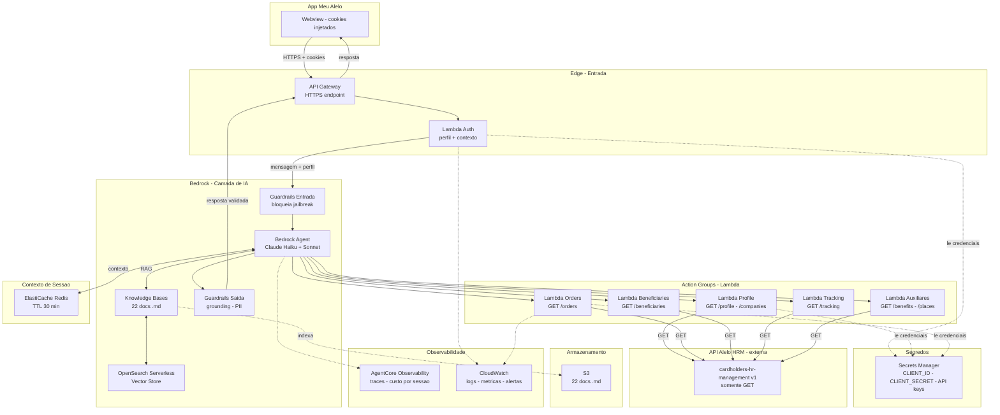
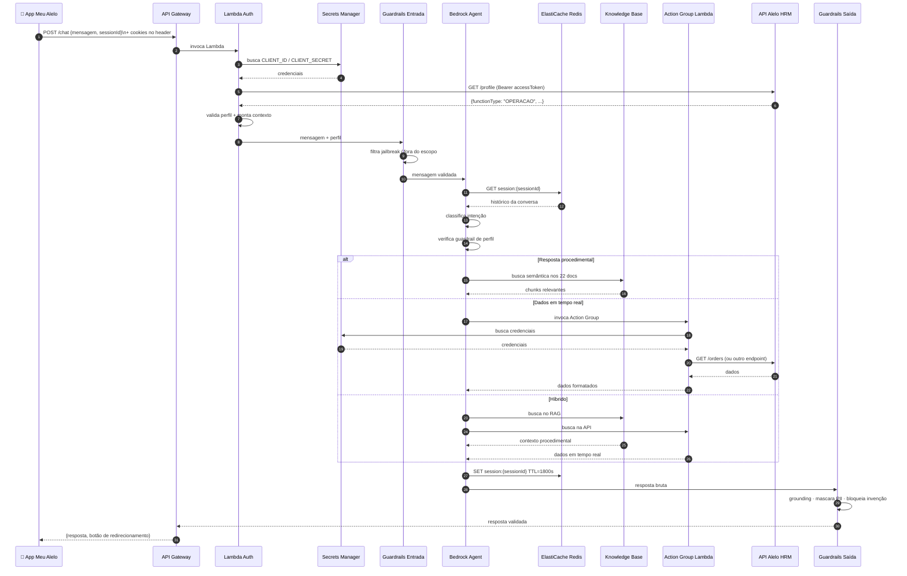
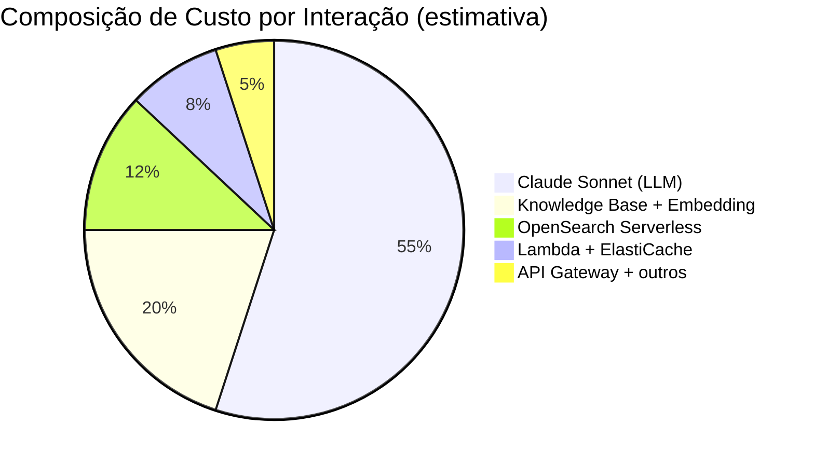
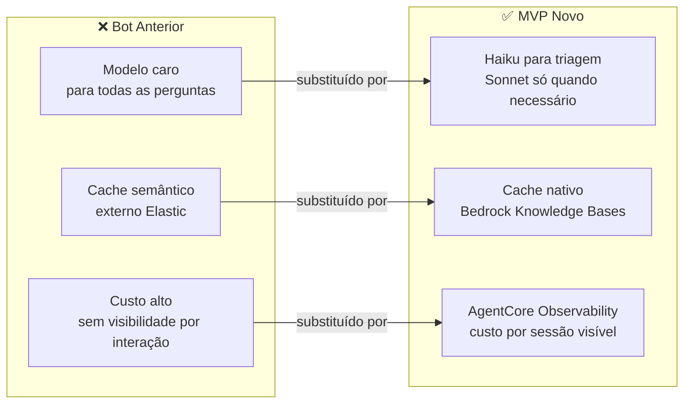
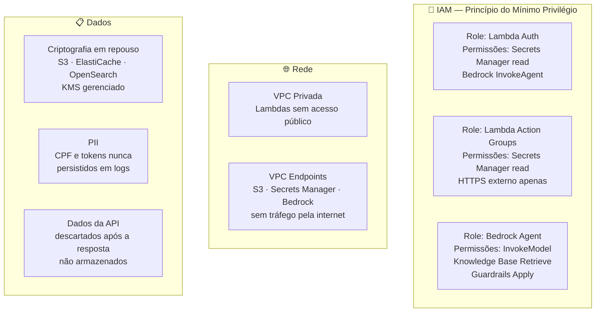

# Infraestrutura AWS — MVP Bot Alelo

**Região:** sa-east-1 (São Paulo)
**Paradigma:** Serverless + Managed AI — sem servidores a gerenciar, escala automática, pague pelo uso.

---

## Visão Geral da Arquitetura

---

## Fluxo de uma Requisição

---

## Componentes — Tecnologia e Justificativa

### 1. API Gateway
| Item | Detalhe |
|---|---|
| **Tecnologia** | Amazon API Gateway (HTTP API) |
| **Função** | Endpoint HTTPS único para o bot; recebe a mensagem e cookies da webview |
| **Por que** | Serverless, escala automática, integra nativamente com Lambda, suporte a CORS para webview |
| **Alternativa descartada** | ALB — desnecessário para um endpoint único sem roteamento complexo |

---

### 2. Lambda Auth
| Item | Detalhe |
|---|---|
| **Tecnologia** | AWS Lambda (Python 3.12) |
| **Função** | Extrai cookies da request, chama `GET /profile`, valida perfil, monta contexto para o Agent |
| **Por que** | Execução pontual sem servidor, tempo médio < 500ms, custo quase zero em baixo volume |
| **Runtime** | Python — SDK Boto3 nativo para Bedrock |

---

### 3. Bedrock Agent
| Item | Detalhe |
|---|---|
| **Tecnologia** | Amazon Bedrock Agents |
| **Função** | Orquestração principal — decide quando usar RAG, quando chamar Action Groups, mantém o fluxo de conversa |
| **Modelo principal** | **Claude Sonnet** (respostas complexas, RAG + API combinados) |
| **Modelo de triagem** | **Claude Haiku** (classificação de intenção, respostas simples) |
| **Por que Bedrock Agents** | Orquestração nativa sem código de grafo, integração direta com Knowledge Bases e Guardrails, disponível em sa-east-1 |
| **Alternativa avaliada** | LangGraph — mais controle de fluxo, mas exige infra própria e mais complexidade para o MVP |

---

### 4. Bedrock Knowledge Bases + OpenSearch Serverless
| Item | Detalhe |
|---|---|
| **Tecnologia** | Bedrock Knowledge Bases + Amazon OpenSearch Serverless (vector store) |
| **Função** | Indexa e faz busca semântica nos 22 arquivos `.md` da pasta `docs/kb` |
| **Modelo de embedding** | Amazon Titan Embeddings v2 |
| **Fonte dos documentos** | Bucket S3 com os 22 `.md` |
| **Por que** | RAG gerenciado — sem necessidade de pipeline de indexação manual; re-indexação automática ao atualizar S3 |
| **Cache semântico** | Nativo no Bedrock Knowledge Bases — evita chamadas repetidas para perguntas similares (substitui Elastic Cache do bot anterior) |

---

### 5. Bedrock Guardrails
| Item | Detalhe |
|---|---|
| **Tecnologia** | Amazon Bedrock Guardrails |
| **Função entrada** | Bloqueia jailbreak, prompt injection, tópicos fora do escopo |
| **Função saída** | Grounding (impede invenção), mascaramento de PII (CPF, tokens), filtro de conteúdo |
| **Por que** | Gerenciado, disponível em sa-east-1, configurável sem código, auditável |

---

### 6. Action Groups — Lambda
| Item | Detalhe |
|---|---|
| **Tecnologia** | AWS Lambda (Python 3.12) — uma função por grupo de endpoints |
| **Função** | Executa as chamadas GET para a API HRM da Alelo com os headers de autenticação |
| **Grupos** | Profile/Companies · Orders · Beneficiaries · Tracking · Auxiliares (benefits, products, places) |
| **Credenciais** | Lidas do Secrets Manager a cada invocação — nunca em variável de ambiente |
| **Por que Lambda** | Integração nativa com Bedrock Agents como Action Groups, serverless, isolamento por grupo |

---

### 7. ElastiCache Redis
| Item | Detalhe |
|---|---|
| **Tecnologia** | Amazon ElastiCache for Redis (Serverless) |
| **Função** | Persistir contexto da conversa dentro de uma sessão (histórico de mensagens, empresa selecionada, último colaborador mencionado) |
| **TTL** | 1800s (30 min de inatividade encerra a sessão) |
| **Por que** | AgentCore Memory indisponível em sa-east-1 — Redis é a alternativa mais simples e de menor latência |
| **Alternativa** | DynamoDB — mais barato em baixo volume, porém latência maior; avaliar após MVP |

---

### 8. Secrets Manager
| Item | Detalhe |
|---|---|
| **Tecnologia** | AWS Secrets Manager |
| **Função** | Armazena `CLIENT_ID`, `CLIENT_SECRET` e demais credenciais da API Alelo |
| **Por que** | Rotação automática de segredos, integração nativa com Lambda, auditoria via CloudTrail |

---

### 9. S3
| Item | Detalhe |
|---|---|
| **Tecnologia** | Amazon S3 |
| **Função** | Repositório dos 22 arquivos `.md` que alimentam o Knowledge Base |
| **Atualização** | Upload de novo `.md` → Bedrock re-indexa automaticamente |
| **Custo** | Desprezível (< $0,01/mês para 22 arquivos pequenos) |

---

### 10. Observabilidade
| Item | Detalhe |
|---|---|
| **AgentCore Observability** | Traces do agente, latência por etapa, custo por sessão, perguntas sem resposta |
| **CloudWatch Logs** | Logs de Lambda (Auth + Action Groups) |
| **CloudWatch Métricas** | Erros de API, latência de resposta, tokens consumidos |
| **CloudWatch Alarms** | Alerta se custo/hora ultrapassar threshold definido |

---

## Estimativa de Custos

> Cenário base: **500 usuários/dia · 5 mensagens/sessão · 20 dias úteis/mês = 50.000 interações/mês**

### Custo por Interação

### Tabela de Custos Mensais (50k interações)

| Serviço | Unidade | Volume est. | Preço unit. | Custo/mês |
|---|---|---|---|---|
| **Claude Haiku** (triagem) | 1K tokens input | 25.000K | $0,00025 | ~$6 |
| **Claude Haiku** (triagem) | 1K tokens output | 5.000K | $0,00125 | ~$6 |
| **Claude Sonnet** (respostas) | 1K tokens input | 15.000K | $0,003 | ~$45 |
| **Claude Sonnet** (respostas) | 1K tokens output | 7.500K | $0,015 | ~$113 |
| **Bedrock Knowledge Bases** | 1K queries | 50K | $0,10 | ~$5 |
| **Titan Embeddings v2** | 1K tokens | 5.000K | $0,00002 | ~$0,10 |
| **OpenSearch Serverless** | OCU/hora | 2 OCU × 730h | $0,24 | ~$350 |
| **ElastiCache Redis Serverless** | GB-hora | ~10GB × 730h | $0,125 | ~$9 |
| **Lambda** (todas as funções) | Invocações | 250.000 | $0,0000002 | ~$0,05 |
| **API Gateway** | Requisições | 50.000 | $0,0000035 | ~$0,18 |
| **Secrets Manager** | API calls | 250.000 | $0,00001 | ~$0,03 |
| **S3** | Storage + requests | Negligível | — | ~$0,01 |
| **CloudWatch** | Logs + métricas | — | — | ~$5 |
| **Bedrock Guardrails** | Unidades de texto | 50.000 | $0,0075 | ~$4 |
| | | | **TOTAL** | **~$543/mês** |

> ⚠️ **O maior custo é o OpenSearch Serverless** (~65% do total) — mínimo de 2 OCUs sempre ativos. Avaliar desligamento fora do horário comercial pode reduzir para ~$180/mês.

### Cenários de Volume

| Cenário | Interações/mês | Custo estimado |
|---|---|---|
| **MVP lançamento** (200 users/dia) | 20.000 | ~$220/mês |
| **Base** (500 users/dia) | 50.000 | ~$543/mês |
| **Crescimento** (2.000 users/dia) | 200.000 | ~$1.400/mês |
| **Escala** (10.000 users/dia) | 1.000.000 | ~$5.200/mês |

> A partir de ~200k interações/mês, avaliar **Provisioned Throughput** para Claude — reduz custo por token em até 50% com volume previsível.

---

## Estratégia de Redução de Custo vs. Bot Anterior

---

## Ambientes

| Ambiente | Uso | OpenSearch | Modelos | Custo est. |
|---|---|---|---|---|
| **dev** | Desenvolvimento do time | 1 OCU (mínimo) | Haiku only | ~$100/mês |
| **hml** | Homologação / testes de integração | 1 OCU | Haiku + Sonnet | ~$150/mês |
| **prd** | Produção | 2 OCU | Haiku + Sonnet | ~$543/mês |

---

## Segurança

---

## Decisões Pendentes

| Decisão | Opções | Impacto |
|---|---|---|
| Desligar OpenSearch fora do horário comercial | Sim (economiza ~$180/mês) / Não (disponibilidade 24h) | Custo vs. disponibilidade |
| ElastiCache vs. DynamoDB para sessão | Redis (baixa latência) / DynamoDB (mais barato) | Latência de resposta |
| Provisioned Throughput Claude | Quando atingir ~200k interações/mês | Redução de custo em escala |
| Ambiente de homologação separado | Compartilhado com dev / Dedicado | Custo vs. fidelidade dos testes |
