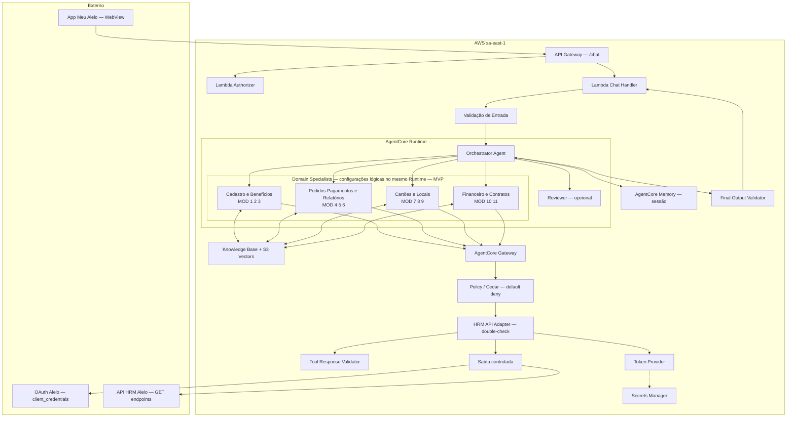

# Infraestrutura AWS — MVP Bot Alelo (Multi-Agent)

**Região:** sa-east-1 (São Paulo)
**Restrição:** cross-region inference desativado · todos os componentes em sa-east-1
**Paradigma:** Serverless + Managed AI + Multi-Agent por domínio
**Diagrama:** `docs/desenhos/arquitetura_bot_alelo_v3.drawio.xml`

---

## Arquitetura Multi-Agente — Visão Geral

### Princípio

Um **Orchestrator Agent** classifica intenção e delega para **Domain Specialists** — configurações lógicas especializadas dentro do mesmo AgentCore Runtime. No MVP não há deployments independentes por domínio.

### Fluxo principal

```
App Meu Alelo → API Gateway → Authorizer → Chat Handler
    → Validação de Entrada
        → Orchestrator Agent (classifica, roteia, finaliza)
            → Domain Specialist (prompt + metadata filter + tools)
                → [se API] AgentCore Gateway → Policy/Cedar → HRM API Adapter
                    → Tool Response Validator
                → [se RAG] Knowledge Base → S3 Vectors
            → [opcional] Reviewer (grounding, coerência)
        → Final Output Validator
    → Chat Handler → resposta ao App
```

### Componentes do MVP



---

## Domain Specialists — MVP (4 configurações)

Cada Specialist é uma configuração lógica composta por: system prompt, metadata filter, allowlist de tools, policy Cedar, schema de entrada/saída e conjunto de testes.


### Specialist 1: Cadastro & Benefícios (MOD 1, 2, 3)

| Atributo | Valor |
|---|---|
| **Objetivo** | Orientar sobre configuração de benefícios, gestão de perfis/interlocutores, cadastro de colaboradores |
| **Perguntas aceitas** | Configuração de benefícios, redes de aceitação, perfis de acesso, CRUD de interlocutores, cadastro individual/planilha, tags |
| **Perguntas recusadas** | Pedidos, boletos, rastreio, relatórios, contratos, faturamento |
| **Documentos** | `1CONFIG_BENE_1`, `1CONFIG_BENE_REDES`, `2CADASTRO_INTERLO_PERFIS`, `2CADASTRO_INTERLO_EDITAR`, `3CADASTRO_COLAB_TELA`, `3CADASTRO_COLAB_PLANILHA`, `3CADASTRO_COLAB_TAGS` |
| **Metadata filter** | `{domain: "cadastro-beneficios", active: true, environment: <env>}` |
| **Tools permitidas** | `GET /beneficiaries`, `GET /places` |
| **Perfis** | MOD 1: DECISAO, GERENCIAMENTO · MOD 2: DECISAO · MOD 3: DECISAO, GERENCIAMENTO, OPERACAO |
| **Policy** | Default deny; MOD 2 requer role=DECISAO; Financeiro bloqueado em todos |
| **Schema entrada** | `{message: str, claims: {user_id, company_id, roles[], scopes[]}, session_context?: obj}` |
| **Schema saída** | `{response: str, sources?: [{doc, score}], action_button?: {label, deeplink}, tools_called?: str[]}` |
| **Modelo sugerido** | Modelo econômico (tipo Haiku) — maioria RAG-only |
| **Fallback** | "Não encontrei essa informação. Contate o suporte." + [BOTÃO] |
| **Testes** | Bloqueio Financeiro; redes corretas; tags só em pedido; CPF imutável |

### Specialist 2: Pedidos, Pagamentos & Relatórios (MOD 4, 5, 6)

| Atributo | Valor |
|---|---|
| **Objetivo** | Orientar criação de pedidos, acompanhar status, boleto/NF, relatórios |
| **Perguntas aceitas** | Fluxo de pedido, pagamento, status, boleto, NF, alterar data, cancelamento, relatórios |
| **Perguntas recusadas** | Configuração de benefícios, rastreio de cartões, 2ª via, contratos, locais |
| **Documentos** | `4PEDIDO_TELA`, `4PEDIDO_PLANILHA`, `5PAG_DISPO`, `5PAG_DISPO_BOLETO`, `5PAG_DISPO_MODELO_COBRANCA`, `6ACOMPA_PEDIDO_STATUS`, `6ACOMPA_PEDIDO_BOLETO_NF`, `6ACOMPA_PEDIDO_ALTERAR_DATA_CREDITOS`, `7RELATORIOS` |
| **Metadata filter** | `{domain: "pedidos-pagamentos-relatorios", active: true, environment: <env>}` |
| **Tools permitidas** | `GET /orders`, `GET /orders/{n}`, `GET /orders/{n}/beneficiaries`, `GET /orders/{n}/bank-ticket`, `GET /orders/{n}/invoice`, `GET /benefits`, `GET /products` |
| **Perfis** | MOD 4: DECISAO, GERENCIAMENTO, OPERACAO · MOD 5: todos (Financeiro: só boleto/NF) · MOD 6: todos |
| **Policy** | Default deny; Financeiro limitado a bank-ticket e invoice; Financeiro sem /beneficiaries |
| **Schema entrada** | `{message: str, claims: {...}, session_context?: {last_order_number?: int}}` |
| **Schema saída** | `{response: str, sources?: [...], orders_preview?: [{number, status, date}], action_button?: {...}}` |
| **Modelo sugerido** | Modelo principal (tipo Sonnet) — RAG+API, complexo |
| **Fallback** | "Não encontrei informações sobre seu pedido. Contate o suporte." |
| **Testes** | Financeiro vê boleto mas não beneficiaries; 3 últimos; NF pós-crédito; cancelamento 30 dias |

### Specialist 3: Cartões & Locais (MOD 7, 8, 9)

| Atributo | Valor |
|---|---|
| **Objetivo** | Rastreio de cartões, orientar 2ª via, consultar locais de entrega |
| **Perguntas aceitas** | Rastreio, status entrega, 2ª via, motivos, prazo, locais, filiais, postos |
| **Perguntas recusadas** | Pedidos, boletos, relatórios, benefícios, contratos |
| **Documentos** | `8RASTREIO_CARTOES`, `manual-emissao-2via`, `10CADASTRO_FILIAIS_TELA`, `10CADASTRO_POSTO_DE_TRABALHO_PLANILHA` |
| **Metadata filter** | `{domain: "cartoes-locais", active: true, environment: <env>}` |
| **Tools permitidas** | `GET /tracking`, `GET /orders/{n}/tracking`, `GET /places` |
| **Perfis** | DECISAO, GERENCIAMENTO, OPERACAO (Financeiro: bloqueado) |
| **Policy** | Default deny; Financeiro bloqueado em todos os MODs |
| **Schema entrada** | `{message: str, claims: {...}, session_context?: {last_tracking_order?: str}}` |
| **Schema saída** | `{response: str, sources?: [...], tracking_preview?: [{order, status}], action_button?: {...}}` |
| **Modelo sugerido** | Modelo econômico — maioria RAG-only, API simples |
| **Fallback** | "Não encontrei informações sobre rastreio. Contate o suporte." |
| **Testes** | Financeiro bloqueado; 3 últimos rastreio; detalhe AR redireciona; 2ª via irreversível |

### Specialist 4: Financeiro & Contratos (MOD 10, 11)

| Atributo | Valor |
|---|---|
| **Objetivo** | Explicar faturamento descentralizado e orientar consulta de contratos |
| **Perguntas aceitas** | Faturamento descentralizado, múltiplos boletos, número de solicitação, contratos, taxas |
| **Perguntas recusadas** | Pedidos novos, rastreio, colaboradores, benefícios, 2ª via |
| **Documentos** | `faturamento-descentralizado`, `9VISUALIZAR_CONTRATOS` |
| **Metadata filter** | `{domain: "financeiro-contratos", active: true, environment: <env>}` |
| **Tools permitidas** | `GET /orders` (somente para número de solicitação, se solicitado) |
| **Perfis** | Todos (Financeiro: leitura limitada) |
| **Policy** | Default deny; leitura permitida para todos; escrita bloqueada sempre |
| **Schema entrada** | `{message: str, claims: {...}}` |
| **Schema saída** | `{response: str, sources?: [...], action_button?: {...}}` |
| **Modelo sugerido** | Modelo econômico — quase exclusivamente RAG |
| **Fallback** | "Não encontrei informações sobre seu contrato. Contate o suporte." |
| **Testes** | Todos os perfis com acesso; taxas corretas; alteração decisão→suporte; nº solicitação |

---

## Evolução futura — 8 Specialists independentes

Quando justificado por escala, modelos diferentes ou deploy independente:

| Specialist futuro | MODs | Trigger de separação |
|---|---|---|
| Benefícios | 1 | Config complexa com fluxo próprio |
| Usuários | 2 | CRUD de interlocutores ampliado |
| Colaboradores | 3 | Integração de escrita (POST) |
| Pedidos | 4 | Simulação/criação de pedidos |
| Acompanhamento | 5 | Volume alto de consultas |
| Relatórios | 6 | Geração real via API |
| Cartões | 7 + 8 | Rastreio e 2ª via divergem |
| Locais + Fat. + Contratos | 9, 10, 11 | APIs dedicadas |

---

## Fluxo de Autorização

```
1. Lambda Authorizer
   → valida JWT/cookie → extrai claims: {user_id, company_id, roles, scopes}

2. Orchestrator Agent
   → classifica intenção → identifica domínio/MOD
   → verifica tabela perfil × MOD (fast-fail; roteamento preliminar)
   → se bloqueado: responde direto sem delegar
   → se permitido: delega ao Domain Specialist

3. Domain Specialist
   → RAG com metadata filter do domínio
   → se precisa de tool: tool call → AgentCore Gateway

4. AgentCore Gateway → Policy / Cedar (default deny)
   → avalia: user_id, company_id, roles, scopes, tool, operation, params
   → verifica vínculo usuário ↔ empresa (company_id ∈ user.companies)
   → se DENY → erro estruturado (Adapter não é chamado)
   → se ALLOW → encaminha ao HRM API Adapter

5. HRM API Adapter (double-check determinístico)
   → re-valida roles + company_id
   → verifica empresa solicitada ∈ empresas autorizadas
   → Token Provider → Bearer → API HRM via Saída Controlada
   → resposta da API

6. Tool Response Validator (pós-API, pré-modelo)
   → sanitiza campos
   → aplica allowlist de campos por operação
   → mascara PII (CPF parcial, email oculto)
   → remove tokens, headers, dados internos
   → valida schema
   → limita tamanho
   → resultado sanitizado → contexto do modelo

7. Domain Specialist gera resposta provisória

8. Reviewer (opcional — somente RAG+API, baixa confiança ou alto risco)
   → retorna resultado estruturado:
     {"approved": bool, "grounded": bool, "retry_recommended": bool,
      "unsupported_claims": [], "missing_information": []}
   → Reviewer NÃO executa retry — apenas recomenda

9. Orchestrator decide sobre retry
   → max 1 retry
   → registra: domínio, motivo, model calls, resultado final

10. Final Output Validator (pós-resposta, pré-Chat Handler)
    → valida schema final
    → mascara PII residual
    → remove tokens e segredos
    → valida fontes citadas
    → valida deeplinks e botões
    → limita tamanho
    → bloqueia conteúdo fora da política
    → resposta final → Chat Handler
```

---

## Autorização por Empresa

- `company_id` autorizado vem dos claims extraídos pelo Authorizer ou do contexto de sessão validado
- O LLM **não pode substituir** livremente esse valor
- Policy Cedar e HRM API Adapter validam que empresa solicitada ∈ conjunto de empresas autorizadas para o usuário
- Regras aplicadas:
  - default deny
  - validação de roles
  - validação de scopes
  - validação da tool
  - validação da operação
  - validação dos parâmetros
  - vínculo usuário ↔ empresa
  - double-check no Adapter

---

## RAG — Metadata Filters

Cada documento no S3 recebe metadata obrigatória na ingestão:

| Campo | Tipo | Obrigatório | Exemplo |
|---|---|---|---|
| `domain` | string | ✅ | `"cadastro-beneficios"` |
| `module` | integer | ✅ | `3` |
| `document_type` | string | ✅ | `"passo-a-passo"` |
| `document_version` | string | ✅ | `"1.0"` |
| `environment` | string | ✅ | `"prd"` |
| `active` | boolean | ✅ | `true` |
| `allowed_profiles` | string[] | auxiliar | `["DECISAO","GERENCIAMENTO","OPERACAO"]` |

- `allowed_profiles` é metadata auxiliar — nunca é a única camada de autorização
- Autorização permanece determinística na Policy/Cedar, fora do RAG
- Cada Specialist filtra `domain` + `active` + `environment` no retrieve

---

## Validadores Determinísticos

### Tool Response Validator

Localizado entre HRM API Adapter e o contexto do modelo.

| Responsabilidade | Implementação |
|---|---|
| Sanitizar resposta da API | Remove headers, status codes internos |
| Allowlist de campos por operação | Configuração por tool |
| Remover tokens e headers | Regex + deny-list |
| Limitar tamanho | Max chars configurável |
| Mascarar PII | CPF parcial, email oculto, telefone oculto |
| Validar schema | JSON Schema por operação |
| Impedir respostas inesperadas ao modelo | Fallback estruturado |

### Final Output Validator

Localizado após Reviewer/Orchestrator, antes do Chat Handler.

| Responsabilidade | Implementação |
|---|---|
| Validar schema final | JSON Schema de resposta |
| Remover tokens e segredos | Regex + deny-list |
| Mascarar PII residual | Mesmas regras de PII |
| Validar fontes citadas | Fonte ∈ docs do domínio |
| Validar deeplinks e botões | Whitelist de rotas permitidas |
| Limitar tamanho | Max chars |
| Bloquear conteúdo fora da política | Deny patterns |

---

## Reviewer (Semântico, Opcional)

- Ativado somente quando: RAG+API combinados, baixa confiança, alto risco (dados financeiros)
- Não executa retries — retorna resultado estruturado ao Orchestrator
- Schema de retorno:

```json
{
  "approved": true,
  "grounded": true,
  "retry_recommended": false,
  "unsupported_claims": [],
  "missing_information": []
}
```

- Orchestrator decide: max 1 retry, registra domínio + motivo + model calls + resultado
- PII, autenticação e autorização **nunca** dependem do Reviewer (são determinísticos)

---

## Model Calls por Tipo de Pergunta

| Tipo | Exemplo | Model calls estimadas | Componentes |
|---|---|---|---|
| RAG simples | "O que é faturamento descentralizado?" | 2 | Orchestrator + Specialist |
| Bloqueio por perfil | Financeiro → colaboradores | 1 | Orchestrator (fast-fail) |
| RAG + API (sem reviewer) | "Quais são meus pedidos?" | 2 | Orchestrator + Specialist (tool call) |
| RAG + API (com reviewer) | "Explica status do pedido X e como altero data" | 3 | Orchestrator + Specialist + Reviewer |
| Com retry | Reviewer recomenda retry | 4 | +1 model call (max) |
| Fallback | "Qual o clima?" | 1 | Orchestrator (rejeita) |

---

## Custos e Latência — Hipóteses a Validar por Benchmark

> ⚠️ Os valores abaixo são hipóteses. Precisam de medição real antes de serem tratados como fatos.

### Plano de medição obrigatório

| Métrica | Como medir | Alvo MVP |
|---|---|---|
| Model calls por interação | AgentCore Observability | A definir |
| Tokens entrada/saída por sessão | Bedrock metrics | A definir |
| Latência p50 / p95 / p99 | CloudWatch + traces | p50 < 5s; p95 < 10s |
| Custo por sessão | Observability + pricing | A definir |
| Custo por domínio | Tag por Specialist | A definir |
| % chamadas com Reviewer | Counter no Orchestrator | < 20% |
| Taxa de retry | Counter no Orchestrator | < 5% |
| Taxa de roteamento incorreto | Avaliação manual + logs | < 3% |
| Taxa sem grounding suficiente | Reviewer metrics | < 5% |

### Hipóteses (não comprovadas)

- Prompts menores por Specialist devem reduzir custo/token vs. agente monolítico
- Reviewer opcional evita overhead em respostas simples
- Multi-agent pode adicionar ~1-2s por hop (classificação)
- MVP com 1 Runtime evita custo de infra adicional por Specialist

---

## Segurança

### Princípios mantidos

- IAM com menor privilégio; roles separadas por responsabilidade
- KMS; TLS em todos os dados em trânsito
- Tokens nunca em logs, prompts ou respostas
- Dados da API HRM descartados após a resposta (LGPD)
- Cookie bruto nunca entra no contexto do modelo
- Default deny em toda autorização
- company_id validado em Policy + Adapter

### Matriz de Permissões IAM

| Componente | Ações permitidas | Não conceder |
|---|---|---|
| Lambda Authorizer | — | Secrets Manager, Bedrock, S3 |
| Lambda Chat Handler | `bedrock-agentcore:InvokeAgent` | Secrets Manager, S3 write |
| AgentCore Runtime | `bedrock:InvokeModel`, `bedrock:Retrieve` | Secrets Manager, Lambda invoke direto |
| AgentCore Gateway | `lambda:InvokeFunction` (Adapter) | Secrets Manager direto |
| HRM API Adapter | `secretsmanager:GetSecretValue` | Bedrock, S3, DynamoDB |
| Lambda Ingestão | `bedrock:StartIngestionJob`, `s3:GetObject` | Secrets Manager, Bedrock Invoke |

---

## Disponibilidade Regional (sa-east-1)

| Serviço | Disponível | Confirmação |
|---|---|---|
| AgentCore Runtime | ✅ | AWS Regions doc, Jul 2026 |
| AgentCore Gateway | ✅ | AWS Regions doc, Jul 2026 |
| AgentCore Memory | ✅ | Anúncio streaming LTM, Mar 2026 |
| AgentCore Observability | ✅ | AWS Regions doc, Jul 2026 |
| Bedrock Knowledge Bases | ✅ | AWS Regions doc, Jul 2026 |
| S3 Vectors | ✅ | Expansão 17 regiões, Mar 2026 |
| Bedrock Guardrails | ✅ | AWS Regions doc, Jul 2026 |
| Titan Embeddings V2 | ✅ | Bedrock models catalog |
| Policy in AgentCore / Cedar | ❌ | Não confirmado em sa-east-1 — pendente validação |
| AgentCore Harness | ❌ | Não listado |
| AgentCore Evaluations | ❌ | Não listado |

---

## Decisões Pendentes

| # | Decisão | Impacto | Responsável |
|---|---|---|---|
| 1 | Policy in AgentCore / Cedar em sa-east-1? | Se indisponível: implementar policy como código no Adapter | Time técnico |
| 2 | Modelo LLM específico in-region | Custo e qualidade | Time técnico |
| 3 | Egress: NAT, proxy ou privado | Custo + rede | Time + Alelo |
| 4 | URL do endpoint OAuth | Bloqueador Token Provider | Carlos (Alelo) |
| 5 | client_credentials server-to-server | Bloqueador automação | Carlos (Alelo) |
| 6 | IaC (CDK vs SAM vs Terraform) | Pipeline | Time |
| 7 | Threshold para ativar Reviewer | Latência vs. qualidade | Benchmark |
| 8 | Limites de tamanho de resposta | UX + custo | Design |
| 9 | Formato dos deeplinks por tela | Integração com app | Time + Alelo |
