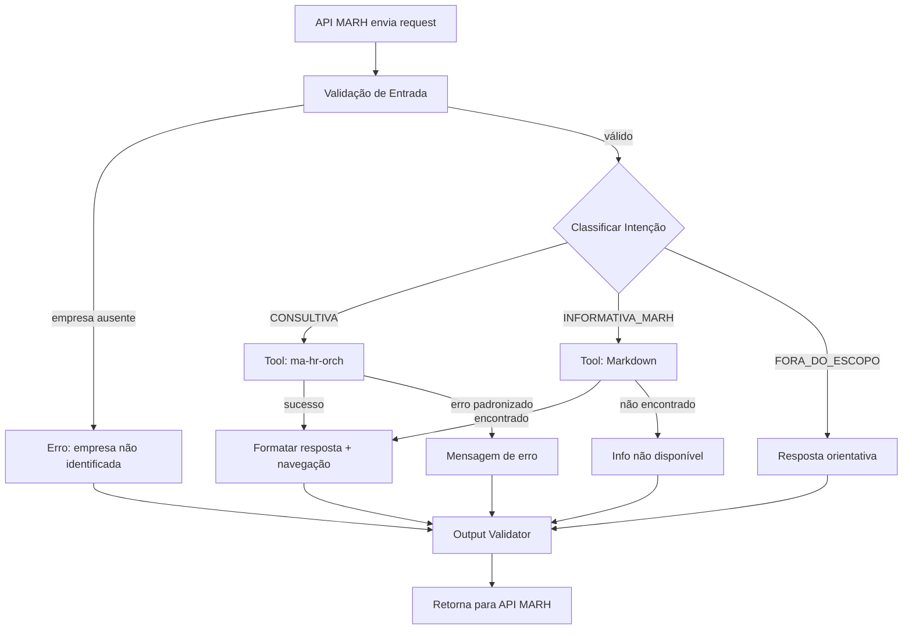
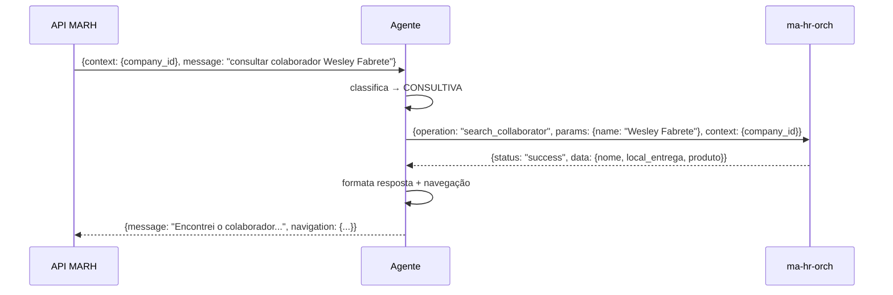
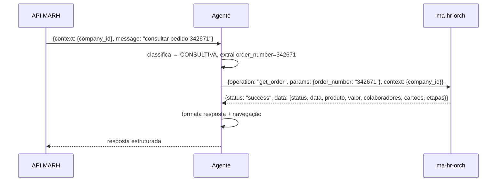
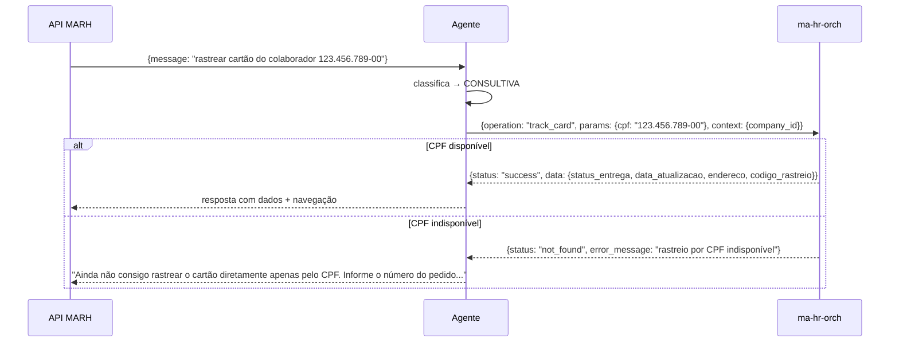

# Workflow do Agente — Fluxos Detalhados

---

## Diagrama Geral



---

## Fluxos por Caso de Uso

### Consultar colaborador por nome



### Consultar colaborador por CPF

Mesmo fluxo, com `params: {cpf: "123.456.789-00"}`.

### Múltiplos colaboradores encontrados

```
ORCH retorna: {status: "multiple_results", data: [{nome, cpf_parcial}, ...]}
Agente: "Encontrei mais de um colaborador. Qual destes você gostaria de consultar?"
  - Lista os resultados
  - Aguarda escolha do usuário
```

### Colaborador não encontrado

```
ORCH retorna: {status: "not_found"}
Agente: "Não encontrei nenhum colaborador com os dados informados para a empresa selecionada."
```

### Consultar pedido por número



### Pedido não encontrado

```
ORCH retorna: {status: "not_found"}
Agente: "Não encontrei o pedido informado para a empresa selecionada."
```

### Consultar último pedido

```
message: "qual foi o último pedido?"
operation: "get_latest_order"
params: {}
```

### Consultar pedidos por status

```
message: "quais são os últimos pedidos com status pago?"
operation: "list_orders_by_status"
params: {status: "pago"}
```

### Status inválido

```
ORCH retorna: {status: "invalid_status"}
Agente: "Não reconheci o status informado. Tente consultar por status como pago, pendente, cancelado ou em processamento."
```

### Rastrear cartão por CPF



### Pergunta informativa (existe no Markdown)

```
message: "o que posso fazer?"
Classifica → INFORMATIVA_MARH
Consulta Markdown → encontra conteúdo
Responde com base no Markdown
```

### Pergunta informativa (não existe no Markdown)

```
Markdown sem resultado
Agente: "Ainda não tenho essa informação disponível sobre o MARH. Posso ajudar com consultas de colaboradores, pedidos e rastreamento de cartões."
```

### Operação transacional recusada

```
message: "cancela o pedido 342671"
Classifica → FORA_DO_ESCOPO
Agente: "No momento eu consigo apenas consultar informações. Para realizar essa ação, acesse a jornada correspondente no Espaço RH."
+ navegação quando aplicável
```

### Empresa selecionada ausente

```
Validação de Entrada detecta: selected_company_id vazio ou ausente
Agente: "Não consegui identificar a empresa selecionada para realizar a consulta. Selecione uma empresa no Espaço RH e tente novamente."
Sem tool call.
```

### Sem permissão

```
ORCH retorna: {status: "no_permission"}
Agente: "Você não tem permissão para consultar informações dessa empresa no Espaço RH."
```

### Falha de segurança

```
ORCH retorna: {status: "security_failed"}
Agente: "Não consegui acessar essas informações porque a validação de segurança não foi concluída. Verifique se sua sessão está ativa e tente novamente."
```

### Indisponibilidade / timeout

```
ORCH retorna: {status: "unavailable"} ou timeout
Agente: "Não consegui consultar essa informação agora. Tente novamente em alguns instantes."
```

### Tentativa de trocar empresa pelo chat

```
message: "consultar pedidos da empresa CNPJ 12.345.678/0001-99"
Agente usa selected_company_id do contexto confiável (ignora CNPJ da mensagem)
Agente: "A consulta considera apenas a empresa selecionada no app. Para consultar outra empresa, selecione-a no Espaço RH."
```
